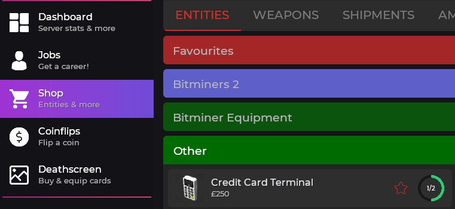

# 💳 Credit Card Terminal

• The credit card terminal can be located in the F4 menu>shop>entities>other

• A few things to note before proceeding further.

1. The purchaser of the credit card terminal is the same person who receives the money
2. You must have the required amount of money already in your bank
3. The actual credit card can be found on the hot-bar 3 see the[ image](https://prnt.sc/1yLDp1W7Nhak) for reference

• How to operate the credit card terminal&#x20;

1. Using the e key enter the desired number into the terminal like [this](https://prnt.sc/skCxmnG0SrdI) and press the green arrow button at the bottom right
2. Using your credit card look at the card reader and left click with the card still in hand and voila!
