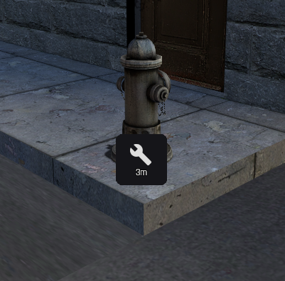
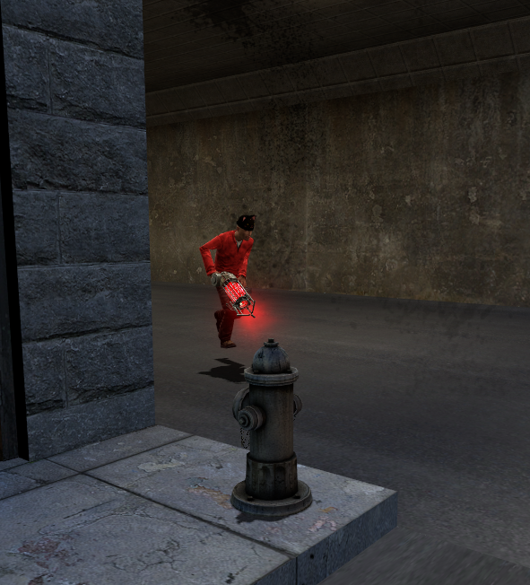
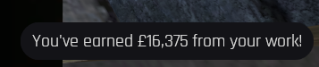

# 👷 City Worker

As a City Worker, your job is to keep the city in check by fixing electrical transformers, fire hydrants and more.

To begin, head over to the Wrench Icon on your screen.

Once there, take a look at the item that requires fixing. If the item shows sparks flying, the Pliers must be used. If the item shows water spraying, the Wrench must be used. Left click on the item to begin the repairs.

Once complete, you will recieve a sum of money. The longer the repair takes, the more money you recieve.

