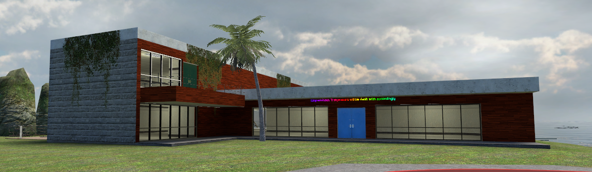
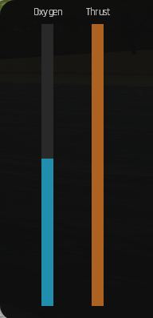
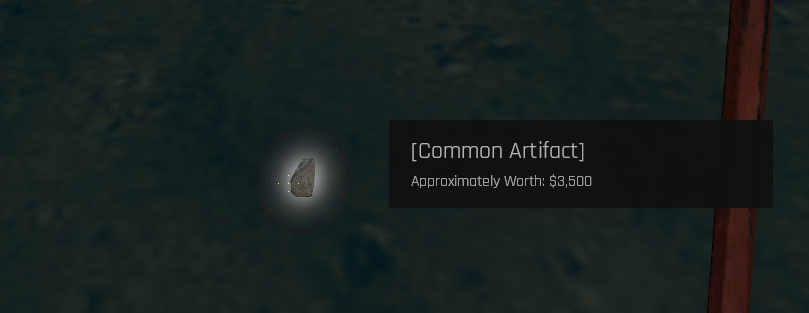
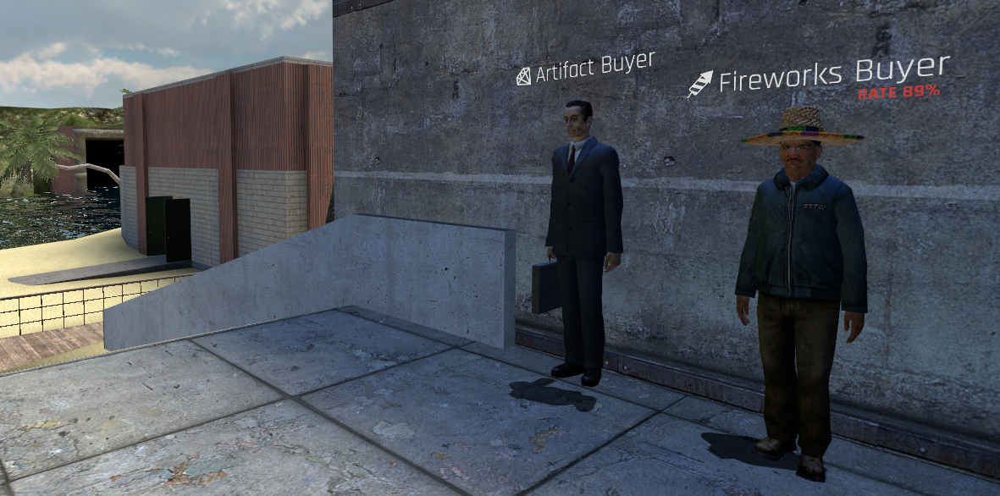

# 🤽 Deep Sea Diver

As a Deep Sea Diver, you are tasked with locating hidden artifacts in the Deep Ocean.

To begin, you must buy the Scuba Gear. Type <mark style="color:purple;"></mark> <mark style="color:purple;"></mark>_<mark style="color:purple;">!unbox</mark>_ in chat to open the unbox store. Navigate to Shop > Utility > Scuba Gear. Purchase the Scuba Gear for £500,000. Once purchased, retrieve the item from the Inventory page. Equip the Scuba Gear by pressing 'E' on the item.


Beware, dying with the Scuba Gear equipped will destroy the item forever. Use <mark style="color:red;">/dropsuit</mark> to drop the Scuba Gear on the floor, allowing you to store it safely in your inventory.


To begin finding artifacts, head over to the Deep Ocean. This is the part of the ocean containing the Island House.

Once in the Deep Ocean, dive down to the floor of the ocean to begin searching for artifacts.

There are 6 types of artifacts:

| Rarity                                       | Avg Sell Price | Spawn Chance |
| -------------------------------------------- | -------------- | ------------ |
| Common                                       | £3500          | 70%          |
| <mark style="color:green;">Uncommon</mark>   | £10000         | 55%          |
| <mark style="color:blue;">Rare</mark>        | £20250         | 48%          |
| <mark style="color:purple;">Epic</mark>      | £43000         | 22%          |
| <mark style="color:yellow;">Legendary</mark> | £97500         | 10%          |
| <mark style="color:orange;">Mystic</mark>    | $340000        | 1%           |

When underwater, your oxygen meter will deplete. Once this reaches 0, you will rapidly take damage. Swimming to the surface will allow you to refill the oxygen.

The thrust meter indicates how much thrust is remaining. Thrust allows you to move faster underwater when holding your **Sprint** key. This depletes slowly, and only recovers once the **Sprint** key is released.

The artifacts are small chunks on the ocean floor. They can be collected by equipping the Ocean Artifact Extractor. Hold E on the artifacts to collect them.

Once you have finished collecting artifacts. Head over to the beach to sell them. The Artifact Buyer is located on the road. Press 'E' on him to sell your artifacts and recieve your cash reward.

<mark style="color:yellow;"></mark>

<mark style="color:orange;"></mark>
