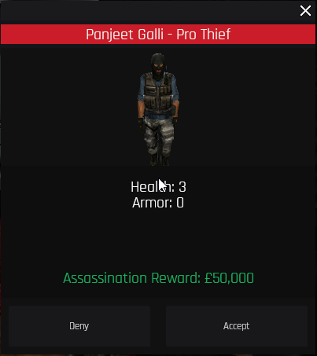

# 🔫 Hitman

The Hitman is a job that allows players to be hired to kill other players.&#x20;

Hits can be placed on anyone in any faction, but you're unable to place hits on other Hitmen.\
Hitman roles are typically taken by skilled shooters, as they will need to be able to take down their targets quickly and efficiently. \
\
To get started, either go up to a player in the Hitman job, be it the Hitman; Pro Hitman or Assassin, and press E on them\
\
\
\
You will be greeted with the menu above when you press E on the preferred hitman.\
You can search a player's name for ease of use.\
Once you have found the preferred player you want murdered, click on them.\
\
.png>)\
\
The above menu will update. \
The minimum hit amount is £50,000.\
Input that amount and click "Place Hit", then the hitman will either accept or deny this hit.\
\
If you are playing the Hitman job, you will need to wait for players to come to you for hired hits, or you can approach players asking if they want your service.\
\
Once a player is interested in your services and they request a hit, the below menu will show.\
\

As the hitman, you can then choose to deny or accept this hit.\
Once accepted, data showing your target, their distance from you and your time left to assassinate your target, will show on the top left of your screen.\
\
.png>)

The above is what it looks like.\
Only the hitman sees this.
