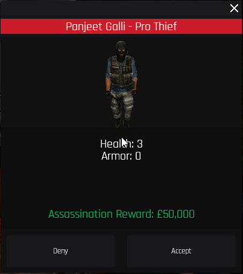

# ☠ Sewer Dweller

Sewer Dwellers are an aggressive form of job that lurks in the sewers. They are notoriously hostile and frequently kill on sight. They are also known to be fairly powerful, therefore caution is suggested when approaching them. It is crucial to stay cautious of your surroundings when traversing the Sewers, as Sewer Dwellers frequently set up traps and ambushes for unprepared adventurers. If you encounter a Sewer Dweller, you should avoid them if at all possible. If you must engage them, bring a large quantity of ammunition.

You can kill inhabitants on sight, but they may also kill you on sight, so it is advised to approach them with caution.

1. Sewer Dwellers
2. King Dwellers
3. Pyscho

Sewer Dwellers have access to a variety of upgrades that can help them survive and thrive in the sewers. These upgrades include:

* Damage Resistance: Sewer Dwellers can take less damage from attacks
* Health Boost: Sewer Dwellers can have their health increased.
* Health Regeneration: Sewer Dwellers can regenerate health over time.
* Sharpened Claws: Sewer Dwellers' claws can deal more damage.
* Speed Boost: Sewer Dwellers can move faster.

You can access this menu by typing /upgrades as a dweller&#x20;

(You may need to respawn to activate some of  the upgrades)

